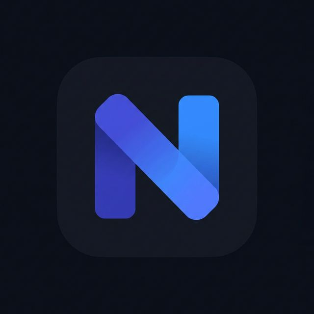

  
  <h1>NotaB</h1>
  
Minimalist, Hızlı ve Akıllı Windows Başlatıcısı

  <a href="#özellikler">Özellikler</a> •
  <a href="#kurulum">Kurulum</a> •
  <a href="#kullanım">Kullanım</a> •

---

**NotaB**, Windows kullanıcıları için geliştirilmiş, Electron tabanlı hızlı bir başlatıcıdır (launcher). MacOS'teki Spotlight veya Windows PowerToys Run benzeri bir deneyim sunar. Sistemde kurulu uygulamaları hızla bulup çalıştırmanın yanı sıra döviz çevirisi, hızlı web aramaları ve TMDB entegrasyonu gibi ek araçları doğrudan klavyenizin ucuna getirir.

Sistem kaynaklarını minimum düzeyde kullanacak şekilde tasarlanmıştır.

## — Özellikler

* **Uygulama Arama ve Başlatma:** Sistemde yüklü olan `.exe` ve `.lnk` dosyalarını tarar. Hatalı yazımları tolere edebilen fuzzy-search algoritması içerir.
* **Kullanım Alışkanlığı (Scoring):** Çok sık arattığınız ve açtığınız uygulamalar skorlanır. Aynı aramayı yaptığınızda en çok kullandığınız uygulama her zaman en üstte çıkar.
* **Hızlı Web Komutları:** Tarayıcıyı açmadan doğrudan arama yapın.
  * `g <sorgu>`: Google araması
  * `y <sorgu>`: YouTube araması
  * `w <sorgu>`: Wikipedia araması
  Veya doğrudan bir web sitesi adresi yazarak o siteye gidebilirsiniz. Örneğin: `google.com` veya `github.com/ebuword`
* **Anlık Döviz Çevirici:** `10 eur` veya `50 usd` gibi sorgular yazarak anlık kurlarla döviz çevirisi yapar.
* **Akıllı İftar & Sahur Vakti (Ramazan Özel):** `iftar`, `sahur` veya `namaz` yazarak coğrafi konumunuza göre (IP tabanlı) Diyanet uyumlu geri sayım widget'ını açıp günün vakitlerini görebilirsiniz.
  * *İftar ve Sahur:* Vaktine ne kadar kaldığını anlık gösterir.
  * *Namaz:* `namaz` araması yaptığınızda bir sonraki vakte olan süreyi gösterir.
* **Film ve Dizi Arama (TMDB):** TMDB entegrasyonu sayesinde `f: film adı` şeklinde film bilgisi ve afişi getirebilirsiniz.
* **Hesap Makinesi:** `120 * 45` gibi matematiksel işlemleri anında çözün.
* **Pano (Clipboard) Entegrasyonu:** Karşınıza çıkan sonuçları enter'a basarak veya tıklayarak anında kopyalayabilirsiniz.
* **Arka Plan Çalışması:** System tray (sistem tepsisi) üzerinden çalışır, işiniz bittiğinde arka planda gizlenerek kaynak tüketimini azaltır.
* **Windows Açılışında Otomatik Başlatma:** Kurulumdan sonra bilgisayar her açıldığında NotaB otomatik olarak arka planda başlar. Sessiz başlangıç modu sayesinde herhangi bir müdahale gerektirmez.
* **Profesyonel Kurulum Sihirbazı:** NSIS tabanlı tam teşekküllü kurulum sihirbazı ile kolayca kurulur. Masaüstü ve Başlat Menüsüne kısayollar otomatik oluşturulur.

## Kurulum

[v1.1.0 Kurulum ve Uygulama Detayları](https://github.com/ebuword/NotaB/releases/tag/v1.1.0) adresinden kurulum dosyasına ve güncel detaylara erişebilirsiniz.

### Hızlı Kurulum
1. `NotaB-Setup-v1.1.0.exe` dosyasını indirin.
2. Kurulum sihirbazını çalıştırın ve yönergeleri takip edin.
3. Kurulum tamamlandıktan sonra `Alt + Space` ile aramaya başlayın.
4. Bilgisayarınızı yeniden başlattığınızda NotaB otomatik olarak arka planda hazır olacaktır.

## — Kullanım

Uygulama çalıştıktan sonra arka planda beklemeye başlar. Arayüzü çağırmak için klavyenizden atanan global kısayolu kullanın:

**Varsayılan Kısayol:** `Alt + Space`

Arama çubuğuna yazabileceğiniz bazı örnek sorgular:
* `code` (Visual Studio Code'u bulur ve açar)
* `github` (Varsayılan tarayıcınızda Google üzerinde 'github' araması yapar)
* `100d` veya `25e` (Dolar veya Euro'nun anlık TL karşılığını gösterir)
* `iftar` (Konumunuza özel İftar veya Sahur geri sayımı başlatır)
* `f: avatar` (TMDB'den Avatar film bilgisi ve afişi)

Ekrana gelen sonuçlar arasında yön tuşlarıyla (Aşağı/Yukarı) gezinebilir ve `Enter` ile işlemi tetikleyebilirsiniz. ESC tuşu veya pencere dışına tıklamak uygulamayı anında gizler.

## — Teknoloji Yığını

* **Electron.js:** Masaüstü pencere yönetimi ve sistem entegrasyonu
* **Node.js (fswin, windows-shortcuts):** Dosya sistemi tarama ve kısayol çözümleme
* **Vanilla HTML/CSS/JS:** Frontend arayüzü (Herhangi bir JS framework'ü kullanılmadan, saf performans odaklı yazılmıştır)
* **electron-builder (NSIS):** Paketleme, kurulum sihirbazı ve dağıtım

## 📄 Lisans

Bu proje **EULA Son Kullanıcı Sözleşmesi** ile lisanslanmıştır. Daha fazla bilgi için [EULA Son Kullanıcı Sözleşmesi](https://github.com/ebuword/NotaB?tab=License-1-ov-file) içerisindeki lisans tanımına göz atabilirsiniz.
