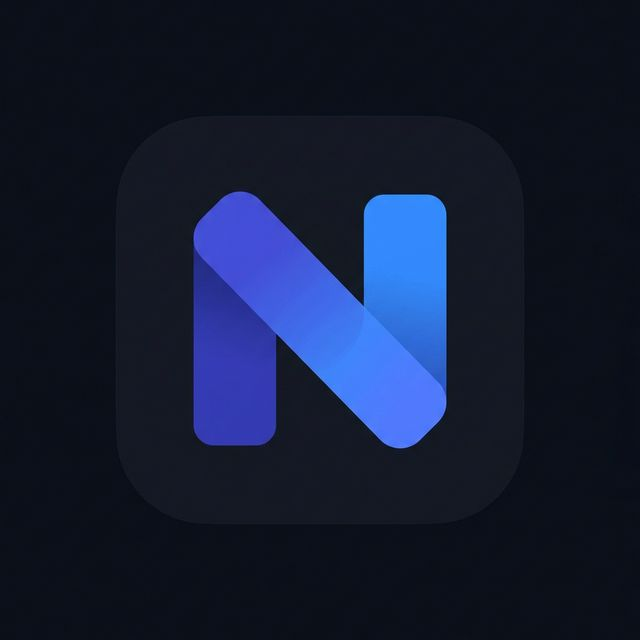

<div align="center">
  
  <h1>NotaB Launcher</h1>
  <p><strong>Windows için Minimalist, Akıllı ve Ultra Hızlı Komut Başlatıcısı</strong></p>

  <p>
    <a href="https://github.com/ebuword/NotaB/releases"></a>
    
    
    
  </p>

  <p>
    <a href="#-özellikler">Özellikler</a> •
    <a href="#-kısayollar--komutlar">Komutlar</a> •
    <a href="#-kurulum">Kurulum</a> •
    <a href="#-geliştirme--derleme">Derleme</a> •
    <a href="#-lisans">Lisans</a>
  </p>
</div>

---

**NotaB**, Windows kullanıcıları için modern Spotlight ve Raycast estetiğini getiren, hafif ve performans odaklı bir başlatıcıdır (launcher). Sisteminizdeki uygulamaları ışık hızında bulup çalıştırmanın yanı sıra anlık serbest piyasa döviz kurları, TMDB film/dizi arama motoru, Diyanet uyumlu iftar/namaz vakitleri sayacı ve matematik motorunu doğrudan klavyenizin ucuna taşır.

Tasarımı gereksiz görsel karmaşadan arındırılmış, göz yormayan derin koyu tonlara ve akıcı klavye etkileşimine sahiptir.

---

## ✨ Özellikler

* 🚀 **Akıllı Uygulama Başlatıcı (Fuzzy Search & Scoring):** Sistemde kurulu tüm `.exe` ve kısayolları otomatik tarar. Yazım hatalarını tolere eden eşleştirme ve sık açtığınız uygulamaları otomatik en üste getiren kullanım skorlama algoritması içerir.
* 💱 **Canlı Döviz & Kur Çevirici:** `10 usd`, `25 eur` veya `100 gbp` gibi doğal sorgularla anlık serbest piyasa ve TCMB kurları üzerinden TL karşılığını anında hesaplar.
* 🎬 **TMDB Film ve Dizi Keşfi:** `f: avatar` veya `f: breaking bad` yazarak film/dizi afişini, vizyon yılını, IMDb/TMDB puanını ve özet konusunu başlatıcı penceresinden ayrılmadan görüntüleyin.
* 🌙 **Namaz & İftar/Sahur Vakitleri:** `iftar`, `sahur` veya `namaz` aramalarında IP konumunuza göre Diyanet uyumlu vakitleri ve bir sonraki vakte kalan süreyi canlı sayaçla gösterir.
* 🧮 **Gelişmiş Matematik Motoru:** `120 * 45`, `sqrt(144) + 25` gibi karmaşık işlemleri ve fonksiyonları (sin, cos, log, üs) anında çözer.
* 📖 **Wikipedia Bilgi Kartları:** `w: kuantum` yazarak ilgili Wikipedia makalesinin özetini ve görselini hızla inceleyin.
* 🌐 **Hızlı Web & YouTube Araması:**
  * `y: <sorgu>`: Doğrudan YouTube araması
  * `g: <sorgu>`: Google araması
  * `github.com` veya `site.com`: Doğrudan siteye yönlendirme ve önizleme kartı
* 📋 **Pano (Clipboard) ve Klavye Odaklılık:** Sonuçları fareye dokunmadan yön tuşlarıyla seçip `Enter` ile anında kopyalayabilir veya çalıştırabilirsiniz.
* ⚡ **Sessiz Sistem Tepsisi (Tray) & Otomatik Başlatma:** Windows açılışında sessizce hazır duruma geçer, bellekte minimum yer kaplar ve ihtiyaç duyulmadığında görünmez kalır.

---

## ⌨ Kısayollar & Komutlar

Arayüzü çağırmak için varsayılan sistem kısayolu:
> **`Alt + Space`** *(veya alternatif olarak `Ctrl + Space`)*

| Komut / Sorgu | Açıklama |
|---|---|
| `code` veya `chrome` | Sistemdeki ilgili uygulamayı bulur ve başlatır |
| `10 usd`, `50 eur`, `100 gbp` | Canlı döviz kurunu TL'ye çevirir |
| `f: interstellar` | TMDB üzerinden film detayları, puanı ve afişini getirir |
| `iftar` / `sahur` / `namaz` | Canlı vakit sayacı ve namaz saatlerini listeler |
| `25 * 4 + sqrt(144)` | Matematiksel hesaplama yapar |
| `w: Albert Einstein` | Wikipedia'dan anında özet bilgi kartı gösterir |
| `y: lo-fi beats` | YouTube'da video aramasını varsayılan tarayıcıda açar |
| `g: react hooks` | Google'da arama yapar |
| `github.com/ebuword` | Web sitesini doğrudan açar |
| `ESC` | NotaB penceresini anında gizler |

---

## 📥 Kurulum

En son kararlı sürümü indirmek için [NotaB Sürümleri (Releases)](https://github.com/ebuword/NotaB/releases) sayfasına gidin.

### Hızlı Kurulum Adımları
1. `NotaB-Setup-v1.2.0.exe` dosyasını indirin.
2. Kurulum sihirbazını başlatın ve kurulumu tamamlayın.
3. Klavyenizden `Alt + Space` tuşlarına basarak NotaB'ı kullanmaya başlayın!

> ℹ️ **Windows SmartScreen Uyarısı Hakkında:**  
> Bağımsız geliştirici sertifikası nedeniyle Windows "Bilinmeyen Yayıncı" uyarısı gösterebilir. Kuruluma devam etmek için **"Ek bilgi"** ve ardından **"Yine de çalıştır"** butonuna tıklayabilirsiniz. Uygulama tamamen güvenlidir ve kaynak kodları açıktır.

---

## 🛠 Geliştirme & Derleme

Projeyi yerel makinenizde çalıştırmak veya kaynak kodundan derlemek için:

```bash
# Depoyu klonlayın
git clone https://github.com/ebuword/NotaB.git
cd NotaB

# Bağımlılıkları yükleyin
npm install

# Geliştirici modunda çalıştırın
npm run dev

# Windows kurulum sihirbazını derleyin (dist/ klasörüne çıkar)
npm run build
```

---

## 🧱 Teknoloji Mimarisi

* **Platform:** [Electron](https://www.electronjs.org/) (Chromium + Node.js)
* **Frontend:** Vanilla JS, CSS3 Modern Grid & Glassmorphism (Sıfır framework, saf performans)
* **Sistem Entegrasyonu:** `fswin`, `windows-shortcuts`
* **Paketleme:** `electron-builder` & NSIS Setup

---

## 📄 Lisans

Bu proje **Son Kullanıcı Lisans Sözleşmesi (EULA)** ile korunmaktadır. Detaylar için [LICENSE.txt](LICENSE.txt) dosyasına göz atabilirsiniz.
